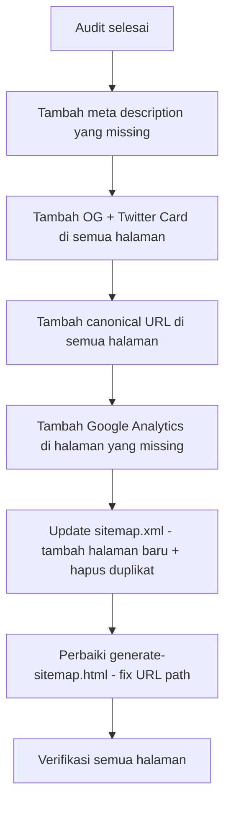

# Plan: Lengkapi SEO Semua Halaman SA UPI

**Domain:** `https://anakupi.my.id`  
**Total halaman publik:** 18 file HTML (1 root + 17 pages)

---

## Hasil Audit SEO

### Ringkasan Status Saat Ini

| Halaman | Meta Description | OG/Twitter | Canonical | Google Analytics |
|---------|:---:|:---:|:---:|:---:|
| `index.html` | ❌ | ❌ | ❌ | ✅ |
| `pages/jurusan.html` | ✅ | ❌ | ❌ | ✅ |
| `pages/lowongan.html` | ✅ | ❌ | ❌ | ✅ |
| `pages/info.html` | ✅ | ❌ | ❌ | ✅ |
| `pages/wiki.html` | ✅ | ❌ | ❌ | ✅ |
| `pages/dokumen.html` | ❌ | ❌ | ❌ | ✅ |
| `pages/faq.html` | ❌ | ❌ | ❌ | ✅ |
| `pages/komunitas.html` | ✅ | ❌ | ❌ | ❌ |
| `pages/tentang.html` | ❌ | ❌ | ❌ | ❌ |
| `pages/hubungi-kami.html` | ✅ | ❌ | ❌ | ❌ |
| `pages/search.html` | ❌ | ❌ | ❌ | ✅ |
| `pages/bandingkan-jurusan.html` | ❌ | ❌ | ❌ | ✅ |
| `pages/post.html` | ✅ | ❌ | ❌ | ✅ |
| `pages/jurusan-detail.html` | ✅ | ❌ | ❌ | ✅ |
| `pages/kategori.html` | ❌ | ❌ | ❌ | ✅ |
| `pages/kalender-akademik.html` | ✅ | ❌ | ❌ | ❌ |
| `pages/maba.html` | ✅ | ❌ | ❌ | ✅ |
| `pages/asisten-ai.html` | ✅ | ❌ | ❌ | ❌ |
| `404.html` | ❌ | ❌ | ❌ | ❌ |

### Sitemap Status

Halaman yang **ada di sitemap** saat ini:
- `/`, `/index.html`, `pages/jurusan.html`, `pages/lowongan.html`, `pages/info.html`, `pages/wiki.html`, `pages/dokumen.html`, `pages/faq.html`, `pages/komunitas.html`, `pages/tentang.html`, `pages/hubungi-kami.html`, `pages/search.html`, `pages/bandingkan-jurusan.html`

Halaman yang **belum ada di sitemap**:
- `pages/kalender-akademik.html`, `pages/maba.html`, `pages/asisten-ai.html`, `pages/kategori.html`, `pages/post.html`, `pages/jurusan-detail.html`

### Generate Sitemap Tool Issue
File `tools/generate-sitemap.html` menghasilkan URL **tanpa** prefix `pages/` sehingga sitemap yang dihasilkan salah.

---

## Rencana Implementasi

### 1. Tambah Meta Description yang Belum Ada

Halaman yang perlu ditambahkan `<meta name="description">`:

| Halaman | Deskripsi yang disarankan |
|---------|--------------------------|
| `index.html` | Portal komunitas Sekumpulan Anak UPI - informasi kampus, wiki, lowongan kerja, jurusan, dan FAQ untuk mahasiswa serta alumni UPI. |
| `pages/tentang.html` | Tentang Sekumpulan Anak UPI, komunitas mahasiswa dan alumni UPI yang menyediakan informasi kampus, lowongan kerja, dan pengetahuan akademik. |
| `pages/search.html` | Cari informasi kampus, wiki, lowongan kerja, dan jurusan UPI dalam satu halaman pencarian terpusat. |
| `pages/bandingkan-jurusan.html` | Bandingkan jurusan UPI berdasarkan akreditasi, peluang masuk, rasio persaingan, biaya pendidikan, dan prospek kerja. |
| `pages/kategori.html` | Jelajahi konten SA UPI berdasarkan kategori: informasi kampus, wiki, lowongan kerja, dan lainnya. |
| `pages/dokumen.html` | Kumpulan dokumen akademik, panduan, surat, dan referensi penting untuk mahasiswa UPI. |
| `pages/faq.html` | Pertanyaan yang sering ditanyakan seputar akademik, maba, UKT, beasiswa, organisasi, dan kehidupan kampus UPI. |
| `404.html` | Halaman tidak ditemukan - kembali ke beranda Sekumpulan Anak UPI. |

### 2. Tambah Open Graph + Twitter Card di Semua Halaman

Setiap halaman akan mendapat blok meta tag berikut, disisipkan setelah `<meta name="description">`:

```html
<!-- Open Graph -->
<meta property="og:type" content="website" />
<meta property="og:site_name" content="Sekumpulan Anak UPI" />
<meta property="og:title" content="[JUDUL HALAMAN]" />
<meta property="og:description" content="[SAMA DENGAN META DESCRIPTION]" />
<meta property="og:url" content="https://anakupi.my.id/[PATH]" />
<meta property="og:image" content="https://anakupi.my.id/assets/images/og-default.svg" />
<meta property="og:locale" content="id_ID" />

<!-- Twitter Card -->
<meta name="twitter:card" content="summary_large_image" />
<meta name="twitter:title" content="[JUDUL HALAMAN]" />
<meta name="twitter:description" content="[SAMA DENGAN META DESCRIPTION]" />
<meta name="twitter:image" content="https://anakupi.my.id/assets/images/og-default.svg" />
```

> **Catatan:** Gambar default OG image berukuran 1200x630px sudah dibuat di `assets/images/og-default.svg`.

> **Khusus `post.html` dan `jurusan-detail.html`:** Tag OG/Twitter akan di-set secara statis dulu di HTML, lalu di-override secara dinamis via JavaScript saat konten dimuat dari Supabase.

### 3. Tambah Canonical URL di Semua Halaman

Setiap halaman mendapat tag `<link rel="canonical">` di `<head>`:

```html
<link rel="canonical" href="https://anakupi.my.id/[PATH HALAMAN]" />
```

Contoh:
- `index.html` → `https://anakupi.my.id/`
- `pages/jurusan.html` → `https://anakupi.my.id/pages/jurusan.html`
- `pages/post.html` → canonical akan diatur dinamis oleh JS berdasarkan query parameter

### 4. Update Sitemap

Tambahkan halaman yang belum ada di `sitemap.xml`:
- `pages/kalender-akademik.html` (priority: 0.80)
- `pages/maba.html` (priority: 0.80)
- `pages/asisten-ai.html` (priority: 0.60)
- `pages/kategori.html` (priority: 0.60)
- `pages/post.html` (priority: 0.60)
- `pages/jurusan-detail.html` (priority: 0.60)

Hapus entry duplikat `/` dan `/index.html` — cukup satu saja (`/`).

### 5. Perbaiki Generate Sitemap Tool

Di `tools/generate-sitemap.html`, URL statis salah (tanpa `pages/` prefix). Perbaikan:
- `${SITE_URL}/jurusan.html` → `${SITE_URL}/pages/jurusan.html`
- Tambah halaman yang belum ada: `kalender-akademik.html`, `maba.html`, `asisten-ai.html`, `kategori.html`, `hubungi-kami.html`, `info.html`, `wiki.html`
- URL dinamis untuk `post.html` dan `jurusan-detail.html` sudah benar secara konseptual, tapi juga perlu prefix `pages/`

### 6. Tambah Google Analytics di Halaman yang Belum Punya

Halaman yang belum ada GA tag:
- `pages/tentang.html`
- `pages/komunitas.html`
- `pages/hubungi-kami.html`
- `pages/kalender-akademik.html`
- `pages/asisten-ai.html`
- `404.html`

Tambahkan snippet GA berikut di `<head>`:
```html
<!-- Google tag (gtag.js) -->
<script async src="https://www.googletagmanager.com/gtag/js?id=G-ZWLZ2952C1"></script>
<script>
  window.dataLayer = window.dataLayer || [];
  function gtag(){dataLayer.push(arguments);}
  gtag('js', new Date());
  gtag('config', 'G-ZWLZ2952C1');
</script>
```

---

## Alur Kerja Implementasi



---

## File yang Akan Dimodifikasi

Total **19 file** yang perlu diedit:

1. `index.html` — tambah description, OG, Twitter, canonical
2. `pages/jurusan.html` — tambah OG, Twitter, canonical
3. `pages/lowongan.html` — tambah OG, Twitter, canonical
4. `pages/info.html` — tambah OG, Twitter, canonical
5. `pages/wiki.html` — tambah OG, Twitter, canonical
6. `pages/dokumen.html` — tambah description, OG, Twitter, canonical
7. `pages/faq.html` — tambah description, OG, Twitter, canonical
8. `pages/komunitas.html` — tambah OG, Twitter, canonical, GA
9. `pages/tentang.html` — tambah description, OG, Twitter, canonical, GA
10. `pages/hubungi-kami.html` — tambah OG, Twitter, canonical, GA
11. `pages/search.html` — tambah description, OG, Twitter, canonical
12. `pages/bandingkan-jurusan.html` — tambah description, OG, Twitter, canonical
13. `pages/post.html` — tambah OG, Twitter, canonical
14. `pages/jurusan-detail.html` — tambah OG, Twitter, canonical
15. `pages/kategori.html` — tambah description, OG, Twitter, canonical
16. `pages/kalender-akademik.html` — tambah OG, Twitter, canonical, GA
17. `pages/maba.html` — tambah OG, Twitter, canonical
18. `pages/asisten-ai.html` — tambah OG, Twitter, canonical, GA
19. `404.html` — tambah description, OG, Twitter, canonical, GA
20. `sitemap.xml` — update entries
21. `tools/generate-sitemap.html` — fix URL paths
